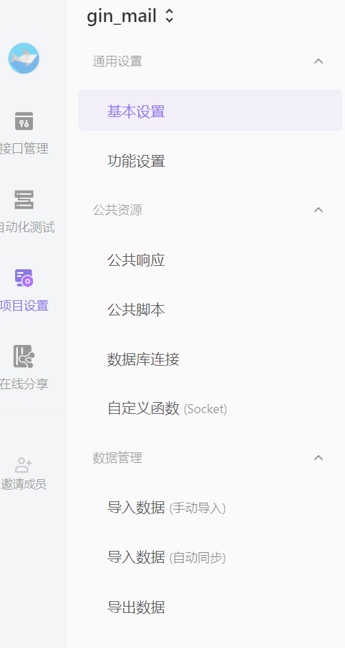
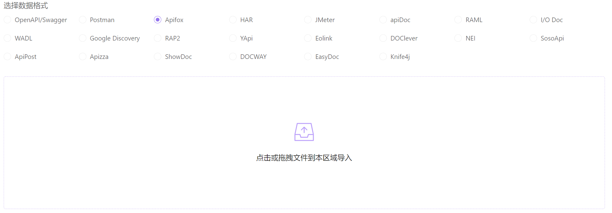
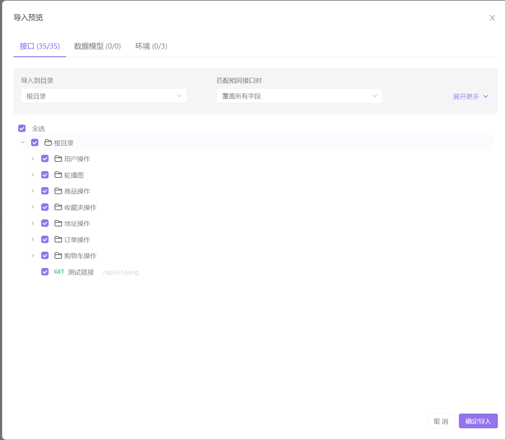

# gin-mall

**基于 gin+gorm+mysql读写分离 的一个电子商场**

本项目改自于作者[Congz](https://github.com/congz666)的[电子商城](https://github.com/congz666/cmall-go)
去除了一些如第三方登录，极验，第三方支付等功能，新增了MySQL读写分离、ELK日志体系、AES对称加密进行数据脱敏等。
在此也非常感谢作者开源！

# (未来)更新说明
- v1 使用了gin等框架构建了简单的服务（默认版本，apifox的接口也仅提供给此版本使用，其余版本需自行修改测试（但也不用改太多好像））
- v1.1 完善redis的使用
- v2 接入docker
- v2.1 尝试接入支付宝/其他支付工具的支付接口（未来版本）

# 项目的主要功能介绍

```
功能模块
·用户操作
·商品操作
·收藏夹操作
·地址操作
·订单操作
·购物车操作
·界面操作（轮播图）
```

具体可以看在doc文档中存留的图片和配置文件

# 项目需要完善的地方

- 很多，由于v2仍未完成（未来时），所以先不提
- 项目代码中我留了很多todo，这些都是我偷懒没有干的完善点，有佬对屎山感兴趣的话可以帮忙完善一下（

# 项目的主要依赖：
Golang V1.18
- gin
- gorm
- mysql
- redis
- ini
- jwt-go
- crypto
- logrus

# 项目结构
```
gin-mall/
├── api
├── cache
├── conf
├── dao
├── doc
├── middleware
├── model
├── pkg
│  ├── e
│  └── util
├── routes
├── serializer
└── service
```
- api : 用于定义接口函数
- cache : 放置redis缓存
- conf : 用于存储配置文件
- dao : 对持久层进行操作
- doc : 存放接口文档
- middleware : 应用中间件
- model : 应用数据库模型
- pkg/e : 封装错误码
- pkg/util : 工具函数
- routes : 路由逻辑处理
- serializer : 将数据序列化为 json 的函数
- service : 接口函数的实现

# 配置文件
`conf/config.ini` 文件配置

```ini
#debug开发模式,release生产模式
[service]
AppMode = debug
HttpPort = :3000

[mysql]
Db = mysql
DbHost = 127.0.0.1
DbPort = 3306
DbUser = 
DbPassWord = 
DbName =

[redis]
RedisDb = redis
RedisAddr = 127.0.0.1:6379
RedisPw =
RedisDbName =

[qiniu]
AccessKey =
SerectKey =
Bucket =
QiniuServer =

[email]
ValidEmail=http://localhost:8080/#/vaild/email/
SmtpHost=smtp.qq.com
SmtpEmail=
SmtpPass=
#SMTP服务的通行证

[es]
EsHost = 127.0.0.1
EsPort = 9200
EsIndex = mylog
```

## 简要说明
1. `mysql` 是存储主要数据。
2. `redis` 用来存储商品的浏览次数。
3. 由于使用的是AES对称加密算法，这个算法并不保存在数据库或是文件中，是第一次登录的时候需要给的值，因为第一次登录系统会送1w作为初始金额进行购物，所以对其的加密，后续支付必须要再次输入，否则无法进行购物。
4. 本项目运用了gorm的读写分离，所以要保证mysql的数据一致性。
6. 用户创建默认金额为 **1w** ，默认头像为 `static/imgs/avatar/avatar.JPG` 
# 导入接口文档

打开apifox，在项目中选择项目设置，然后选择导入数据




选择数据格式，并导入doc中的json文件




效果




# 项目运行
**本项目采用Go Mod管理依赖**

**下载依赖**
```go
go mod tidy
```
**下载依赖**
```go
go run main.go
```